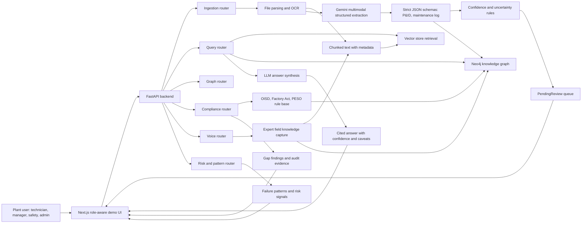

# PlantBrain Architecture

Use this diagram in the deck and demo video to explain why PlantBrain is more than document search.

## Data Flow

1. A user uploads or selects a document.
2. The backend detects file type, parses text, performs OCR when needed, and chunks the content.
3. If the document is visual or structured, Gemini multimodal extraction runs with strict JSON schema output.
4. Extracted entities and relationships are written to Neo4j using idempotent MERGE-style graph operations.
5. Low-confidence extractions are routed to PendingReview instead of polluting the trusted graph.
6. User questions retrieve vector chunks and graph context.
7. The answer layer returns citations, confidence, source freshness, and operational cards.

## Scalability Story

- Routers are separated by capability: ingest, query, graph, compliance, risk, voice, admin.
- Services are separated by responsibility: parsing, embeddings, LLM, Neo4j, compliance, patterns, voice.
- Graph writes are idempotent, so reprocessing corrected scans should update nodes instead of duplicating them.
- Neo4j is optional but preferred for full graph intelligence; local graph fallback keeps demos resilient.
- Confidence gating creates a human-in-the-loop path for messy industrial documents.

## Slide-Friendly One-Liner

PlantBrain turns messy industrial records into a living knowledge graph and answers operational questions with citations, confidence, and compliance context.
